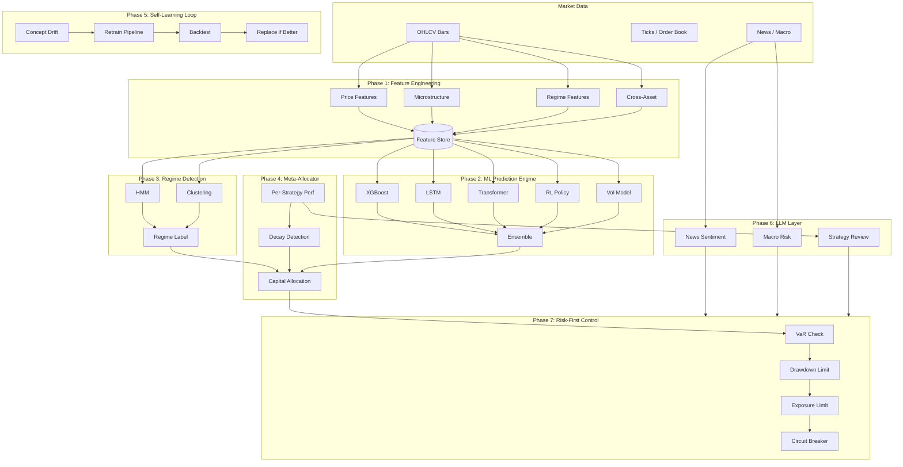
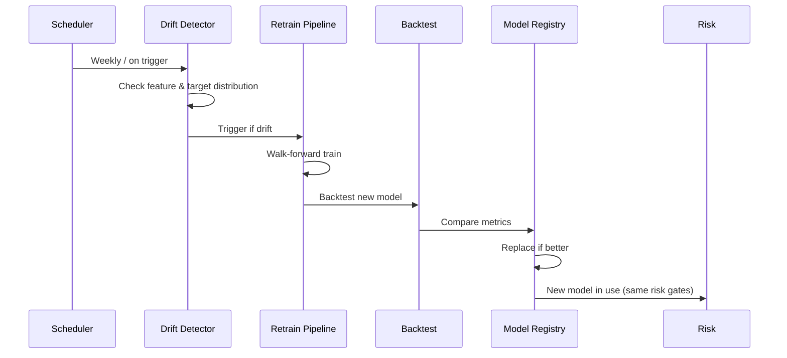

# AI Autonomous Improvement Layer — Architecture

## Overview

The **AI Autonomous Improvement Layer** transforms the existing institutional platform into a **self-learning, adaptive trading intelligence engine**. All AI outputs are advisory; **no decision bypasses the risk engine** (Phase 7).

---

## High-Level Flow

---

## Component Map

| Phase | Component | Location | Responsibility |
|-------|-----------|----------|----------------|
| 1 | Feature pipeline | `src/ai/feature_engineering/` | Price, microstructure, regime, cross-asset features; versioned write to feature store |
| 2 | Model registry | `src/ai/models/registry.py` | Versioning, performance tracker, auto-replace |
| 2 | Ensemble | `src/ai/models/ensemble.py` | XGBoost, LSTM, Transformer, RL, Vol; calibrated probabilities |
| 3 | Regime classifier | `src/ai/regime/classifier.py` | HMM + clustering + volatility; outputs regime label |
| 4 | Meta-allocator | `src/ai/meta_allocator/allocator.py` | Per-strategy Sharpe/win rate/drawdown; decay detection; risk-parity/Kelly weights |
| 5 | Self-learning | `src/ai/self_learning/` | Drift detection, retrain pipeline, backtest, replace |
| 6 | LLM layer | `src/ai/llm/` | Sentiment, macro risk, strategy review; **no order placement** |
| 7 | Risk gate | `src/risk_engine/` (existing) | All AI recommendations pass VaR, drawdown, exposure, circuit breaker |

---

## Risk-First Guarantee

- **LLM** only suggests risk parameter or weight changes; an operator or automated policy applies them after risk check.
- **Meta-allocator** output weights are capped and passed through `RiskManager`.
- **Ensemble** signals are treated as strategy signals: they go to the same order path and risk checks.
- **Regime** only enables/disables strategies or adjusts allocation; it does not bypass limits.

---

## Self-Learning Workflow

---

## Deployment

- **Feature pipeline**: runs on bar close (stream or batch); writes to feature store with version.
- **Models**: trained in batch (weekly or on drift); promoted via registry after backtest.
- **Regime**: updated every N bars; state cached in Redis.
- **Meta-allocator**: runs after strategy P&L update; outputs weights for next cycle.
- **LLM**: invoked on schedule or event (earnings, RBI); results stored and optionally applied via config.
- **Blue/green**: new model version deployed as new service or config; rollback by reverting model version.
