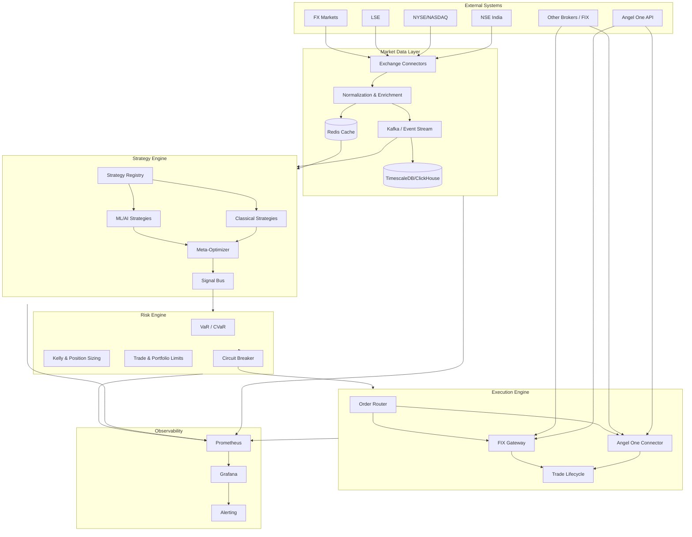

# Institutional-Grade Autonomous Trading Platform — Architecture

## 1. Executive Summary

This document describes the architecture of a **next-generation, institutional-grade autonomous trading platform** that operates globally (NSE India first, then NYSE/NASDAQ, LSE, FX), makes real-time buy/sell decisions, applies multi-strategy and ML-driven logic, and optimizes for risk-adjusted returns with full productionization, observability, and compliance.

**Design principles:** Risk-first, modular microservices, event-driven, async, horizontally scalable, zero single point of failure, audit-ready.

---

## 2. High-Level Architecture Diagram

---

## 3. Component Architecture

### 3.1 Market Data Layer

| Component | Responsibility | Tech |
|-----------|----------------|------|
| **Connectors** | WebSocket/REST per exchange; auto-reconnect, backpressure | Async Python, aiohttp |
| **Normalizer** | Unified tick/bar schema; time-sync (exchange → UTC) | Python |
| **Cache** | Real-time L1 (latest quote, order book snapshot) | Redis |
| **Stream** | Tick/bar events to strategies | Kafka / NATS |
| **Historical** | Bars, order book history, ticks | TimescaleDB / ClickHouse |

- **Resilience:** Exponential backoff, circuit breaker, dead-letter queue for failed normalizations.
- **Contracts:** `Tick`, `Bar`, `OrderBookSnapshot` (see `src/core/events.py`).

### 3.2 Strategy Engine (Multi-Strategy)

- **Plugin contract:** Each strategy implements `generate_signals(market_state) -> List[Signal]` with `score`, `portfolio_weight`, `risk_level`.
- **Classical:** EMA/SMA crossover, MACD, RSI, Bollinger, ATR, breakout, mean reversion, momentum, volatility breakout, order-flow/VWAP.
- **ML:** LSTM/Transformer/XGBoost/RandomForest predictors; RL agent for entry/exit; meta-optimizer for parameter tuning.
- **Ensemble:** Weighted combination of strategy outputs; risk budget per strategy.

### 3.3 Risk Management & Capital Allocation

- **Metrics:** VaR (parametric/simulation), CVaR, max drawdown, True Sharpe, Kelly, Optimal f.
- **Limits:** Position size, single-trade loss, portfolio exposure, sector concentration, correlation/diversification.
- **Actions:** Block trade if over limit; trigger circuit breaker (pause new orders, optional flatten).

### 3.4 Execution / Order Routing

- **Brokers:** Angel One SmartAPI (India first), REST/WebSocket; FIX and other brokers as adapters.
- **Order types:** Limit, Market, IOC, FOK; smart routing and price-improvement logic.
- **Lifecycle:** New → PartiallyFilled → Filled / Cancelled / Rejected; retries, slippage tracking, latency metrics.
- **Compliance:** Strategy ID and timestamp on every order; full audit log.

### 3.5 Backtesting & Simulation

- **Inputs:** Historical 1m/tick/orderbook and bars.
- **Realism:** Slippage, latency, fees (broker, exchange, tax).
- **Methods:** Walk-forward, rolling window, Monte Carlo, regime-based.
- **Outputs:** Equity curve, drawdown, Sharpe, strategy comparison.

### 3.6 Data Warehouse & Feature Store

- **Raw:** Ingested feeds and historical store.
- **Feature store:** Time-series features for ML; versioned, reproducible.
- **Schema:** Normalized per asset class and exchange.

### 3.7 Observability & Compliance

- **Metrics:** Prometheus (latency, P&L, order counts, risk metrics).
- **Dashboards:** Grafana (live P&L, orders, risk, SLA).
- **Alerts:** Email, webhook, mobile; SLA and risk breach.
- **Audit:** Order/trade logs, strategy ID, risk triggers, config changes.

---

## 4. Data Flows

1. **Real-time path:** Exchange → Connector → Normalize → Redis + Kafka → Strategy Engine → Signals → Risk Engine → Execution → Broker.
2. **Historical path:** Connector / Datalake → TSDB/ClickHouse → Backtesting & Feature Store.
3. **Control path:** API (FastAPI) for config, start/stop strategies, risk limits; feature flags; blue/green deployment.

---

## 5. Non-Functional Requirements

- **Reliability:** No single point of failure; auto-recovery; graceful degradation (e.g., stop new orders if data stale).
- **Performance:** Sub-second signal-to-order where required; high-throughput ingest (Kafka partitioning).
- **Scalability:** Stateless strategy/risk/execution workers; horizontal scaling; event-driven decoupling.

---

## 6. Technology Stack Summary

| Layer | Choices |
|-------|--------|
| Language | Python (async), FastAPI / Go for low-latency API if needed |
| Events | Kafka / NATS |
| Cache | Redis |
| DB | PostgreSQL (metadata), TimescaleDB/ClickHouse (time-series) |
| API | FastAPI, OpenAPI |
| Containers | Docker, Kubernetes |
| CI/CD | GitHub Actions |
| Observability | Prometheus, Grafana, structured logging |

---

## 7. File Structure (Skeleton)

See repository root: `src/` (core, market_data, strategy_engine, risk_engine, execution, backtesting, feature_store, api, monitoring), `deploy/`, `tests/`, `docs/`.
